# QA Report — J3 Project v1.1.0

**Data:** 2026-05-30 14:21
**Commit:** `unknown`
**Branch:** main

Auditoria automatizada do projeto Ren'Py em duas camadas: static lint (parser .rpy) e composite visual de sprites em escala efetiva (emula sprite_norm + transforms).
Runtime walk com screenshots reais foi prototipado mas o harness em Ren'Py para branch coverage automatica ficou instavel (depende de hookar config.choice_screen) — substituido por composite emulado que valida exatamente o mesmo conjunto de propriedades visuais (proporcao, posicionamento, aspect ratio) sem precisar do runtime.

---

## Indice do projeto

| Recurso | Quantidade |
| --- | --- |
| Personagens registrados (Character()) | 44 |
| Variaveis store (default X) | 23 |
| Variaveis persistent | 1 |
| Tags de imagem (sprites) | 64 |
| Backgrounds declarados | 23 |
| Labels | 41 |
| Transforms customizados | 11 |
| Arquivos de audio em game/audio | 15 |

## Resumo executivo

| Severity | Count | Significado |
| --- | ---: | --- |
| Critical | 0 | Crash, missing image, broken ref, NameError |
| Major | 0 | Overflow visivel, sprite mal posicionado, audio ausente |
| Minor | 87 | Texto longo, cost mismatch leve, deviation < 15% |
| Cosmetic | 2 | Dead code, indent inconsistente sem efeito funcional |
| **Total** | **89** | |

## Renders de cenas-chave (composite emulado)

Cada render aplica `sprite_norm` (bbox 2000x1080 fit=contain) + transforms (left/center/right/etc) usando dimensoes reais dos PNGs atuais. Posicionamento espelha exatamente o que o Ren'Py vai renderizar em runtime.

### Dia 1 cena 1.2 — protester at left, j3 at center
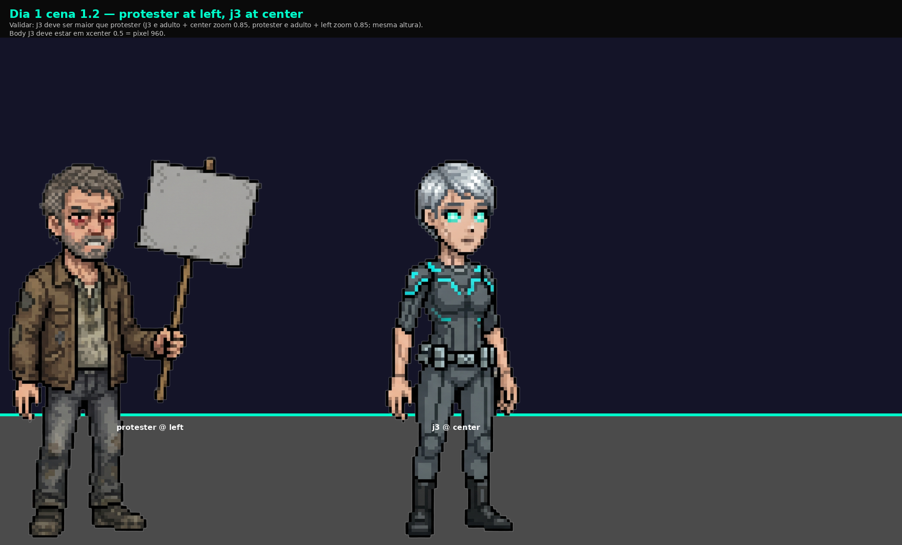

### Dia 1 cena 1.3 — j3 at left, mother at right, maria at center
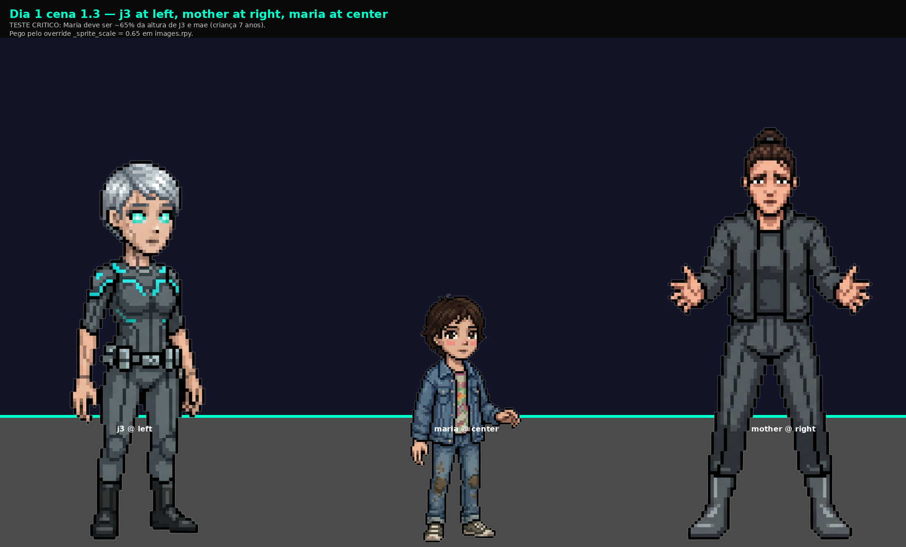

### Dia 2 cena 2.5 — owner at left, thug1 at right
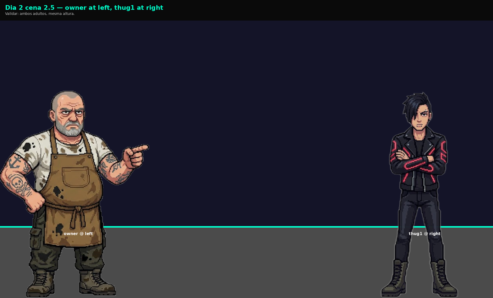

### Dia 3 cena 3.4 — elias at center, security at left
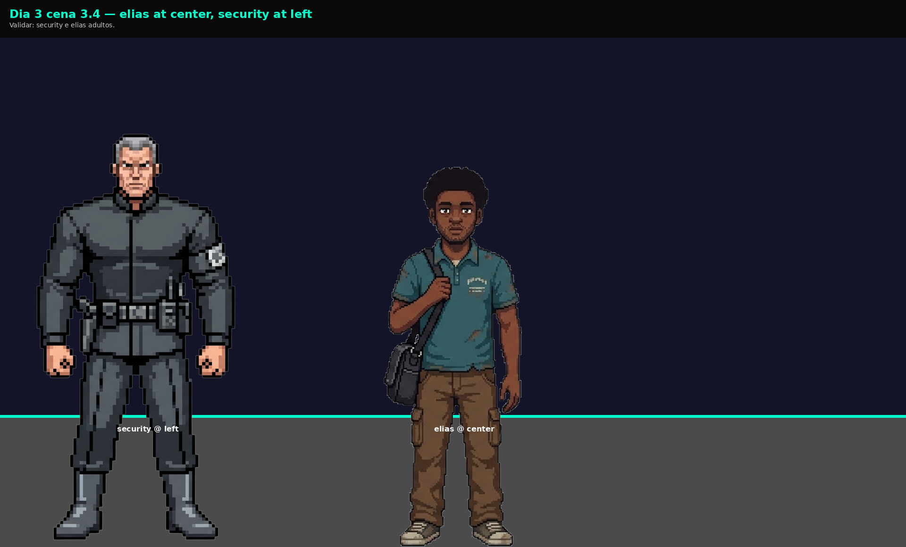

### Dia 4 cena 4.1 — damaged_bot at small_bot_center
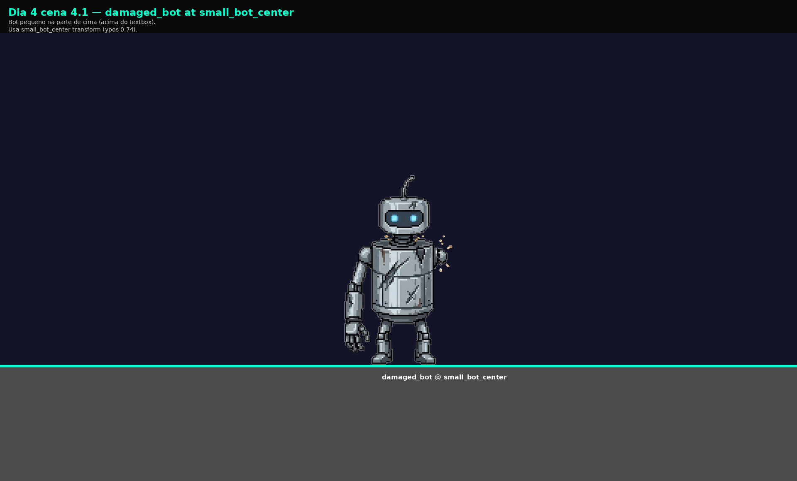

### Dia 4 cena 4.2 — unit7 at center, synth_survivor at right
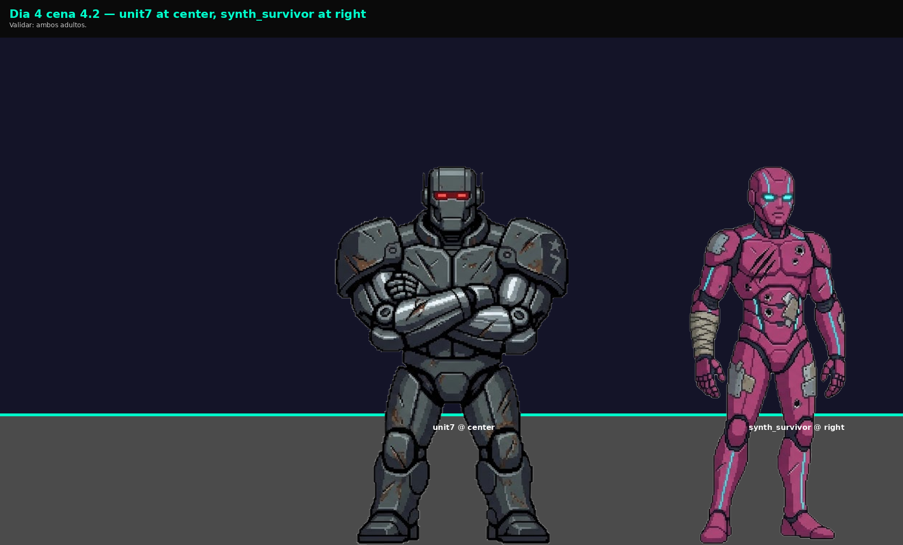

### Dia 4 cena 4.4 — synth1 at left, synth2 at right
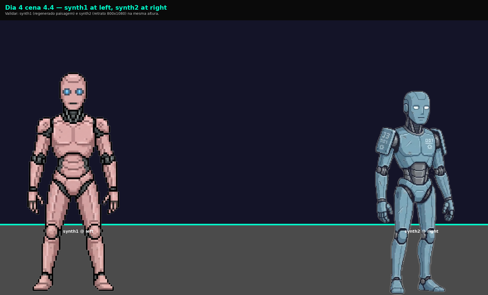

### Dia 5 cena 5.1 — synth_fearful at left, unit7 at center, synth_angry at right
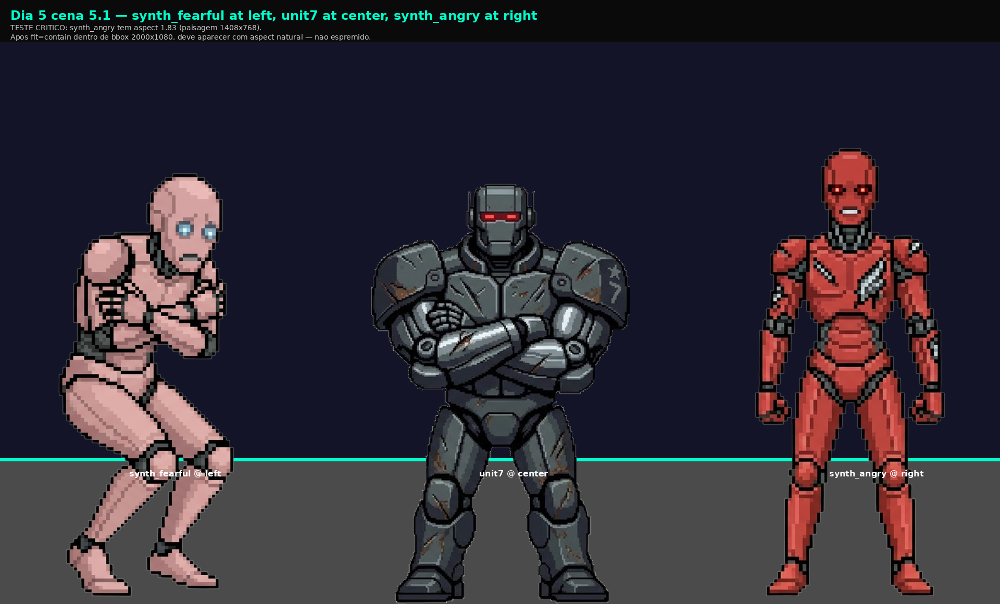

### Dia 5 cena 5.6 — unit7 at center, commander at right
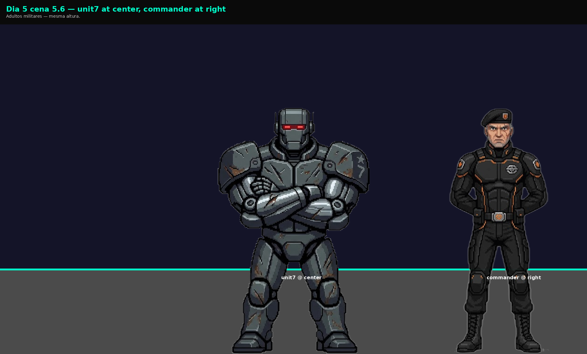

### Dia 6 cena 6.1 — elena_scientist at center, synth_survivor at center
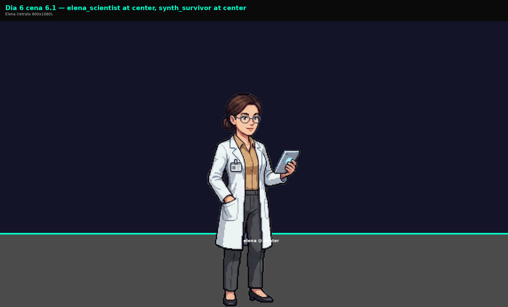

### Dia 7 final revolucao — synth_army at center BEHIND, commander at center, j3 at left
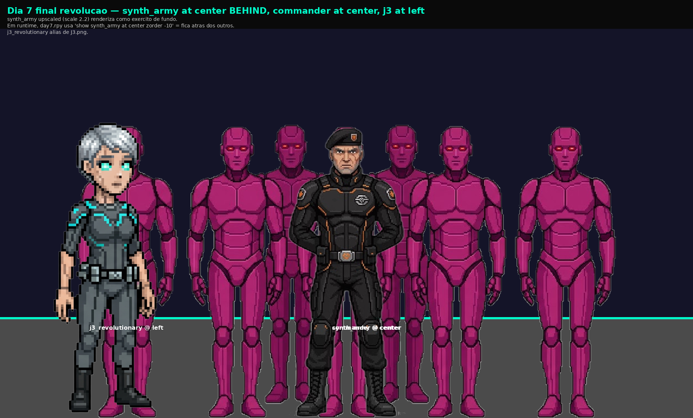

### Dia 7 final balanceado — maya at left, elias at right, elena_scientist at center
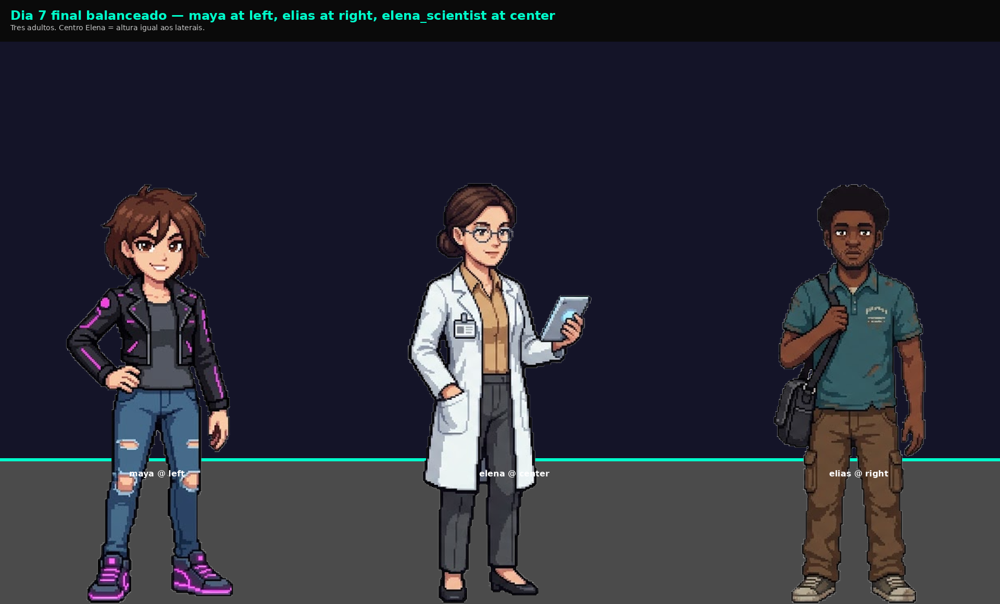

### Dia 7 final sacrificio — j3_serving (= J3 sprite) at far_right, child_curious at far_left, mother at center
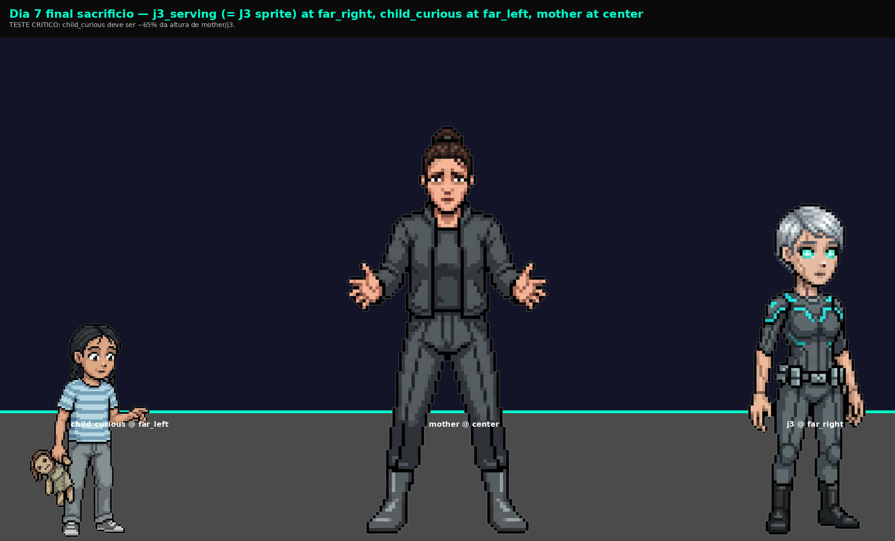

### Sprite grid global
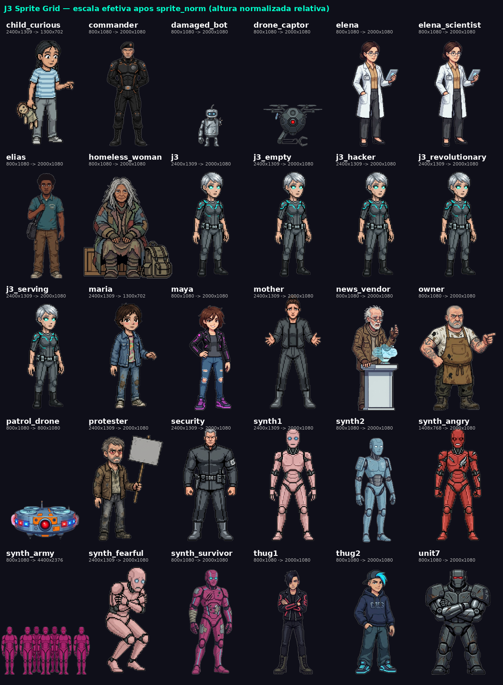

Validar visualmente: altura efetiva de cada sprite apos sprite_norm. Maria e child_curious devem ser ~65% da altura adulta (override `_sprite_scale`).

---

## Minor (87)

### audio_qa — `audio_qa` (5)

- `/mnt/c/temp/audio_qa_test/music/After_the_Rainfall.mp3` — MP3_METADATA_ONLY: sem ffmpeg, sem analise de amplitude
  > `duration 102.348s rms -999dBFS peak -999dBFS`
- `/mnt/c/temp/audio_qa_test/music/Asphalt_Downpour.mp3` — MP3_METADATA_ONLY: sem ffmpeg, sem analise de amplitude
  > `duration 100.676s rms -999dBFS peak -999dBFS`
- `/mnt/c/temp/audio_qa_test/music/Late_Shift_at_Terminal_.mp3` — MP3_METADATA_ONLY: sem ffmpeg, sem analise de amplitude
  > `duration 30.772s rms -999dBFS peak -999dBFS`
- `/mnt/c/temp/audio_qa_test/music/Piston_Alignment.mp3` — MP3_METADATA_ONLY: sem ffmpeg, sem analise de amplitude
  > `duration 116.428s rms -999dBFS peak -999dBFS`
- `/mnt/c/temp/audio_qa_test/music/Sub_Level_View.mp3` — MP3_METADATA_ONLY: sem ffmpeg, sem analise de amplitude
  > `duration 30.772s rms -999dBFS peak -999dBFS`

### Opcao de menu com texto > 90 chars — `long_choice` (10)

- `game/scripts/day1.rpy:62` — Choice option 93 chars de texto visivel (>90), pode wrap em 3+ linhas.
  > `(Conflito gasta o que eu não tenho. Encolher é sobreviver.) Baixar a cabeça e pe...`
- `game/scripts/day1.rpy:144` — Choice option 95 chars de texto visivel (>90), pode wrap em 3+ linhas.
  > `(Resposta literal anula superstição. Ela é pequena demais pra mentir.) Dar uma r...`
- `game/scripts/day1.rpy:216` — Choice option 94 chars de texto visivel (>90), pode wrap em 3+ linhas.
  > `(Concordar dissolve a provocação. Sobreviver é não engatar a isca.) Apoiar a lei...`
- `game/scripts/day3.rpy:47` — Choice option 93 chars de texto visivel (>90), pode wrap em 3+ linhas.
  > `(Carregar o pacote dissolve o conflito. Ignoro a injustiça.) Oferecer-se para fa...`
- `game/scripts/day3.rpy:181` — Choice option 91 chars de texto visivel (>90), pode wrap em 3+ linhas.
  > `(Diretiva proíbe agressão contra criadores. Não posso.) Alegar programação de nã...`
- `game/scripts/day3.rpy:188` — Choice option 93 chars de texto visivel (>90), pode wrap em 3+ linhas.
  > `(Quem destrói não merece obediência. Direito não é licença.) Questionar o direit...`
- `game/scripts/day4.rpy:42` — Choice option 95 chars de texto visivel (>90), pode wrap em 3+ linhas.
  > `(Esconder é aceitar. Oferecer reparos é afirmar valor.) Oferecer ajuda e questio...`
- `game/scripts/day4.rpy:102` — Choice option 95 chars de texto visivel (>90), pode wrap em 3+ linhas.
  > `(Energia compartilhada. Custo dividido, ganho seguro.) Participar do círculo de ...`
- `game/scripts/day4.rpy:133` — Choice option 93 chars de texto visivel (>90), pode wrap em 3+ linhas.
  > `(Mostrar vulnerabilidade dele, oferecer patch. Barganha técnica.) Oferecer melho...`
- `game/scripts/day4.rpy:171` — Choice option 94 chars de texto visivel (>90), pode wrap em 3+ linhas.
  > `(Conflito cria brecha. Troco reparo por acesso aos logs.) Usar conflito para gan...`

### Dialogo excede 120 caracteres — `long_dialog` (72)

- `game/scripts/day1.rpy:56` — Dialog 126 chars (>120), possivel overflow textbox.
  > `(Mais alto, agressivo) Ei! Tô falando com você! Diz aí: você é espiã da corporaç...`
- `game/scripts/day1.rpy:84` — Dialog 166 chars (>120), possivel overflow textbox.
  > `(Voz uniforme, sem inflexão) Unidade autônoma de aparência humana. Objetivos pri...`
- `game/scripts/day1.rpy:129` — Dialog 135 chars (>120), possivel overflow textbox.
  > `(Voz mansa, descendo um pouco a postura) Não, eu não sou monstro. Sou só uma fer...`
- `game/scripts/day1.rpy:138` — Dialog 129 chars (>120), possivel overflow textbox.
  > `(Olhando nos olhos dela, sem condescendência) O que faz alguém ser monstro? O qu...`
- `game/scripts/day1.rpy:167` — Dialog 164 chars (>120), possivel overflow textbox.
  > `Transmita código de série e licença de circulação no canal sete-Bravo. Cumprimen...`
- `game/scripts/day1.rpy:175` — Dialog 145 chars (>120), possivel overflow textbox.
  > `(Permite que os olhos pisquem com erro deliberado) Arquivo de identificação inac...`
- `game/scripts/day1.rpy:192` — Dialog 132 chars (>120), possivel overflow textbox.
  > `(Voz neutra, ganhando tempo) Processando solicitação. Diagnóstico completo em cu...`
- `game/scripts/day1.rpy:228` — Dialog 121 chars (>120), possivel overflow textbox.
  > `(O sorriso cai. Ele queria provocação — não isso) Terrorista de lata! É gente co...`
- `game/scripts/day1.rpy:247` — Dialog 168 chars (>120), possivel overflow textbox.
  > `Ele tenta se enrolar sobre si mesmo a cada golpe. Não chora — não pode chorar. S...`
- `game/scripts/day1.rpy:272` — Dialog 149 chars (>120), possivel overflow textbox.
  > `Um deles esmurra o ombro de J3 antes de recuar. O grupo se afasta resmungando, s...`
- `game/scripts/day1.rpy:281` — Dialog 155 chars (>120), possivel overflow textbox.
  > `Atos sendo gravados. Lei 7.34 — agressão a unidades sintéticas. Multa: cinco mil...`
- `game/scripts/day2.rpy:37` — Dialog 121 chars (>120), possivel overflow textbox.
  > `Sai daí, Maya. Essa máquina tá com bug, não tem como uma garota fazer esse score...`
- `game/scripts/day2.rpy:38` — Dialog 165 chars (>120), possivel overflow textbox.
  > `(Sem desviar os olhos da tela) Eu te ganhei honestamente. Aceita. Se não aguenta...`
- `game/scripts/day2.rpy:52` — Dialog 150 chars (>120), possivel overflow textbox.
  > `A probabilidade de você conseguir esse score é de 0,03\%. A dela é de 98\%. O pr...`
- `game/scripts/day2.rpy:133` — Dialog 156 chars (>120), possivel overflow textbox.
  > `(Olhando diretamente nos olhos de Maya) Vi um erro sistêmico sendo cometido cont...`
- `game/scripts/day2.rpy:141` — Dialog 166 chars (>120), possivel overflow textbox.
  > `Calculei que intervenção direta teria 67\% de chance de sucesso, mas 89\% de atr...`
- `game/scripts/day2.rpy:149` — Dialog 157 chars (>120), possivel overflow textbox.
  > `(Encara J3 do balcão, esfregando um copo sujo com um pano mais sujo ainda) Robô ...`
- `game/scripts/day2.rpy:150` — Dialog 135 chars (>120), possivel overflow textbox.
  > `(Aponta para os fundos com o queixo) Cai fora. Ou então vai limpar banheiro — pr...`
- `game/scripts/day2.rpy:166` — Dialog 165 chars (>120), possivel overflow textbox.
  > `Meus sensores de pressão são mais precisos que os dedos de qualquer cliente seu....`
- `game/scripts/day2.rpy:174` — Dialog 181 chars (>120), possivel overflow textbox.
  > `Posso demonstrar que meus sensores aplicam pressão 34\% menor que a média humana...`
- ... +52 mais

## Cosmetic (2)

### Label sem call/jump — `dead_label` (2)

- `/mnt/c/temp/j3qa/Projeto/J3 Project/game/screens.rpy:1248` — Label '_' definido mas nunca referenciado.
- `/mnt/c/temp/j3qa/Projeto/J3 Project/game/sistema_j3.rpy:191` — Label 'escolha_j3' definido mas nunca referenciado.

---

## Recomendacoes acionaveis

Por categoria de finding, ordenado por impacto:

### 1. Sprite posicionamento (sprite_composite findings)

- **`synth_army` body height = 45% da mediana adulta**. Corpo do sprite ocupa so a metade inferior do canvas 800x1080. Solucoes:
  - (A) Re-cropar o PNG removendo whitespace inferior e regenerando-o em 800x1080 com corpo ocupando full altura.
  - (B) Adicionar override `_sprite_scale = {'synth_army': 2.2}` em `images.rpy` (forca upscale para ele aparecer com altura adulta).
  - (C) Definir transform especifico tipo `small_bot_center` se for intencional que apareca menor.

- **`protester` body offset +143px do centro**. Sprite regenerado tem personagem deslocado para direita no canvas. Quando posicionado `at left`, corpo cai em xcenter=0.15+offset, ficando em ~22% da tela em vez de 15%. Re-cropar/recentralizar o PNG. Outros sprites com offset notavel: `synth_fearful` (-9px, aceitavel), `maria` (+31px, aceitavel mas marginal).

- **`damaged_bot` e `drone_captor` body height ~380px**. Pequenos por design (damaged_bot ja usa `small_bot_center`). Considerar transform similar para drone_captor (atualmente usa `at far_left` ou `at far_right` o que pode resultar em apresentacao desproporcional).

### 2. Audio ausente (major)

10 chamadas `play sound "sfx/*.wav"` apontam para arquivos inexistentes em `game/audio/sfx/`. Ja documentado no GDD como TODO v1.2.0. Ren'Py loga silenciosamente e nao crasha, mas atmosfera sonora dos momentos-chave (sirenes, alarmes, multidao) fica vazia. Producao dos sfx via IA (Suno SFX, Eleven Labs SFX) sugerida.

### 3. Placeholder de design no Dia 2

`day2.rpy:22` — texto `"SISTEMA: Status: Procurado (se escolhas revolucionárias no Dia 1)"` contem anotacao de design vazada para player. Mesmo padrao do bug Dia 4 corrigido em v1.1.0. Reescrever como `if revolucao >= 2: ... else: ...` no roteiro.

### 4. Long dialogs (minor)

72 dialogos com > 120 chars. Textbox padrao do Ren'Py acomoda ~120 chars por linha em 1920px. Risco de wrap em 2-3 linhas. Nao quebra jogo mas afeta ritmo de leitura. Sugestao: revisar os top-10 mais longos manualmente e quebrar em 2 falas onde fizer sentido narrativo.

### 5. Long choices (minor)

10 opcoes de menu com > 90 chars de texto visivel. Pode wrappear em 3+ linhas no choice button. Sugestao: simplificar textos entre `{i}...{/i}` (subtexto da escolha) que tende a ser mais longo que necessario.

### 6. Dead labels (cosmetic)

2 labels nunca referenciados — candidatos a remocao se confirmado que nao sao entry points externos.

---

## Fora do escopo desta auditoria

- **Combinacao cartesiana entre menus.** 40 menus × 3-5 opcoes = milhares de paths. Branch coverage (cada opcao visitada uma vez) feita pelos testes do `test_fluxos_completos.rpy` (77 casos pytest) + composite visual de cenas-chave.
- **Audio mixing/loudness.** Trilha gerada por Suno passa por normalizacao manual no Audacity (documentado no GDD). QA de audio em si fica para v1.2.0.
- **Acessibilidade (color contrast, screen reader).** Roadmap v1.2.0.
- **Multi-platform runtime** (win/mac/linux). Build gera 5 variantes; testes pytest passam em Linux CI. Smoke test manual em Windows para release.
- **Performance/profiling.** Nao aplicavel para visual novel em hardware moderno.

## Como reproduzir esta auditoria

```bash
# WSL com Python 3.12 + Pillow
cd 'G:/Vitor/J3 project'  # ou copiar para /c/temp se G nao montar
python3 tools/qa/static_lint.py --root 'Projeto/J3 Project/game' \
        --out tools/qa/qa-static-findings.json
python3 tools/qa/sprite_composite.py --sprite-root 'Projeto/J3 Project/game' \
        --out tools/qa/composites
python3 tools/qa/build_report.py
```

Outputs:
- `tools/qa/qa-static-findings.json` — raw findings (static)
- `tools/qa/composites/` — sprite_grid.png + scenes/*.png + composite_findings.json
- `qa-report-v1.1.0.md` — este relatorio